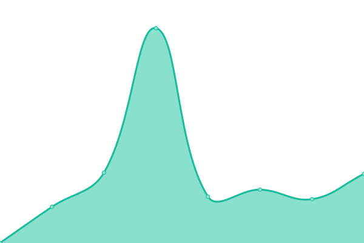

# [📈 Live Status](https://gitgrub.github.io/uptest): <!--live status--> **🟧 Partial outage**

<!--
This repository contains the open-source uptime monitor and status page for [gitgrub](https://gitgrub.github.io/uptest), powered by [Upptime](https://github.com/upptime/upptime).
-->

<!--
With [Upptime](https://upptime.js.org), you can get your own unlimited and free uptime monitor and status page, powered entirely by a GitHub repository. We use [Issues](https://github.com/gitgrub/uptest/issues) as incident reports, [Actions](https://github.com/gitgrub/uptest/actions) as uptime monitors, and [Pages](https://gitgrub.github.io/uptest) for the status page.
-->

<!--start: status pages-->
<!-- This summary is generated by Upptime (https://github.com/upptime/upptime) -->
<!-- Do not edit this manually, your changes will be overwritten -->
<!-- prettier-ignore -->
| URL | Status | History | Response Time | Uptime |
| --- | ------ | ------- | ------------- | ------ |
|  [ABV Missi](https://www.abv-styling.at) | 🟥 Down | [abv-missi.yml](https://github.com/gitgrub/uptest/commits/HEAD/history/abv-missi.yml) | 

 0ms
     
 | 

<a href="https://gitgrub.github.io/uptest/history/abv-missi">0.00%</a>
    

|  [Brun Immo](http://immobilien.brun.at) | 🟩 Up | [brun-immo.yml](https://github.com/gitgrub/uptest/commits/HEAD/history/brun-immo.yml) | 

 1738ms
     
 | 

<a href="https://gitgrub.github.io/uptest/history/brun-immo">100.00%</a>
    

|  [DynDNS afraid](https://freedns.afraid.org) | 🟥 Down | [dyn-dns-afraid.yml](https://github.com/gitgrub/uptest/commits/HEAD/history/dyn-dns-afraid.yml) | 

 230ms
     
 | 

<a href="https://gitgrub.github.io/uptest/history/dyn-dns-afraid">99.73%</a>
    

|  [ping Vivaldi forum](104.22.77.159) | 🟥 Down | [ping-vivaldi-forum.yml](https://github.com/gitgrub/uptest/commits/HEAD/history/ping-vivaldi-forum.yml) | 

 0ms
     
 | 

<a href="https://gitgrub.github.io/uptest/history/ping-vivaldi-forum">0.00%</a>
    

|  [mTest.22](178.79.148.229) | 🟩 Up | [m-test-22.yml](https://github.com/gitgrub/uptest/commits/HEAD/history/m-test-22.yml) | 

 114ms
     
 | 

<a href="https://gitgrub.github.io/uptest/history/m-test-22">100.00%</a>
    

|  [mTest.443](178.79.148.229) | 🟥 Down | [m-test-443.yml](https://github.com/gitgrub/uptest/commits/HEAD/history/m-test-443.yml) | 

 0ms
     
 | 

<a href="https://gitgrub.github.io/uptest/history/m-test-443">0.00%</a>
    

|  [oe24.tv](https://www.oe24.at) | 🟩 Up | [oe24-tv.yml](https://github.com/gitgrub/uptest/commits/HEAD/history/oe24-tv.yml) | 

 368ms
     
 | 

<a href="https://gitgrub.github.io/uptest/history/oe24-tv">100.00%</a>
    

|  [hdaustria.at](https://livetv.hdaustria.at) | 🟩 Up | [hdaustria-at.yml](https://github.com/gitgrub/uptest/commits/HEAD/history/hdaustria-at.yml) | 

 1488ms
     
 | 

<a href="https://gitgrub.github.io/uptest/history/hdaustria-at">100.00%</a>
    

|  [canal+](https://play.canalplus.at) | 🟩 Up | [canal.yml](https://github.com/gitgrub/uptest/commits/HEAD/history/canal.yml) | 

 129ms
     
 | 

<a href="https://gitgrub.github.io/uptest/history/canal">100.00%</a>
    

|  [objekta.at](https://www.objekta.at) | 🟩 Up | [objekta-at.yml](https://github.com/gitgrub/uptest/commits/HEAD/history/objekta-at.yml) | 

 891ms
     
 | 

<a href="https://gitgrub.github.io/uptest/history/objekta-at">100.00%</a>
    

<!--end: status pages-->

[**Visit our status website →**](https://gitgrub.github.io/uptest)

## 📄 License

- Powered by: [Upptime](https://github.com/upptime/upptime)
- Code: [MIT](./LICENSE) © [gitgrub](https://gitgrub.github.io/uptest)
- Data in the `./history` directory: [Open Database License](https://opendatacommons.org/licenses/odbl/1-0/)
