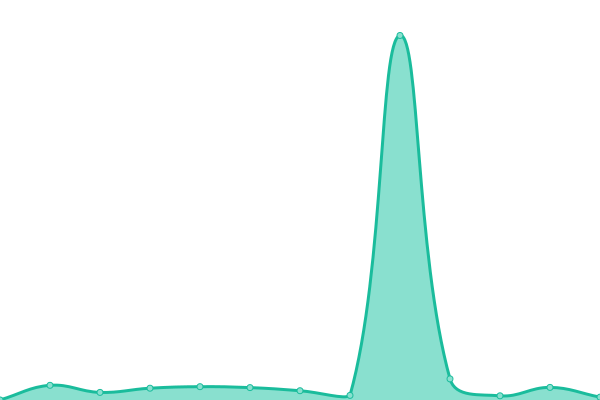

# [📈 Live Status](https://gitgrub.github.io/uptest): <!--live status--> **🟧 Partial outage**

<!--
This repository contains the open-source uptime monitor and status page for [gitgrub](https://gitgrub.github.io/uptest), powered by [Upptime](https://github.com/upptime/upptime).
-->

<!--
With [Upptime](https://upptime.js.org), you can get your own unlimited and free uptime monitor and status page, powered entirely by a GitHub repository. We use [Issues](https://github.com/gitgrub/uptest/issues) as incident reports, [Actions](https://github.com/gitgrub/uptest/actions) as uptime monitors, and [Pages](https://gitgrub.github.io/uptest) for the status page.
-->

<!--start: status pages-->
<!-- This summary is generated by Upptime (https://github.com/upptime/upptime) -->
<!-- Do not edit this manually, your changes will be overwritten -->
<!-- prettier-ignore -->
| URL | Status | History | Response Time | Uptime |
| --- | ------ | ------- | ------------- | ------ |
|  [ABV Missi](https://www.abv-styling.at) | 🟩 Up | [abv-missi.yml](https://github.com/gitgrub/uptest/commits/HEAD/history/abv-missi.yml) | 

 3821ms
     
 | 

<a href="https://gitgrub.github.io/uptest/history/abv-missi">98.91%</a>
    

|  [Brun Immo](http://immobilien.brun.at) | 🟩 Up | [brun-immo.yml](https://github.com/gitgrub/uptest/commits/HEAD/history/brun-immo.yml) | 

 772ms
     
 | 

<a href="https://gitgrub.github.io/uptest/history/brun-immo">100.00%</a>
    

|  [DynDNS afraid](https://freedns.afraid.org) | 🟩 Up | [dyn-dns-afraid.yml](https://github.com/gitgrub/uptest/commits/HEAD/history/dyn-dns-afraid.yml) | 

 766ms
     
 | 

<a href="https://gitgrub.github.io/uptest/history/dyn-dns-afraid">100.00%</a>
    

|  [https](https://no.itsnot.there) | 🟥 Down | [https.yml](https://github.com/gitgrub/uptest/commits/HEAD/history/https.yml) | 

 0ms
     
 | 

<a href="https://gitgrub.github.io/uptest/history/https">0.00%</a>
    

|  [ping-test](no.itsnot.there) | 🟩 Up | [ping-test.yml](https://github.com/gitgrub/uptest/commits/HEAD/history/ping-test.yml) | 

 0ms
     
 | 

<a href="https://gitgrub.github.io/uptest/history/ping-test">100.00%</a>
    

<!--end: status pages-->

[**Visit our status website →**](https://gitgrub.github.io/uptest)

## 📄 License

- Powered by: [Upptime](https://github.com/upptime/upptime)
- Code: [MIT](./LICENSE) © [gitgrub](https://gitgrub.github.io/uptest)
- Data in the `./history` directory: [Open Database License](https://opendatacommons.org/licenses/odbl/1-0/)
